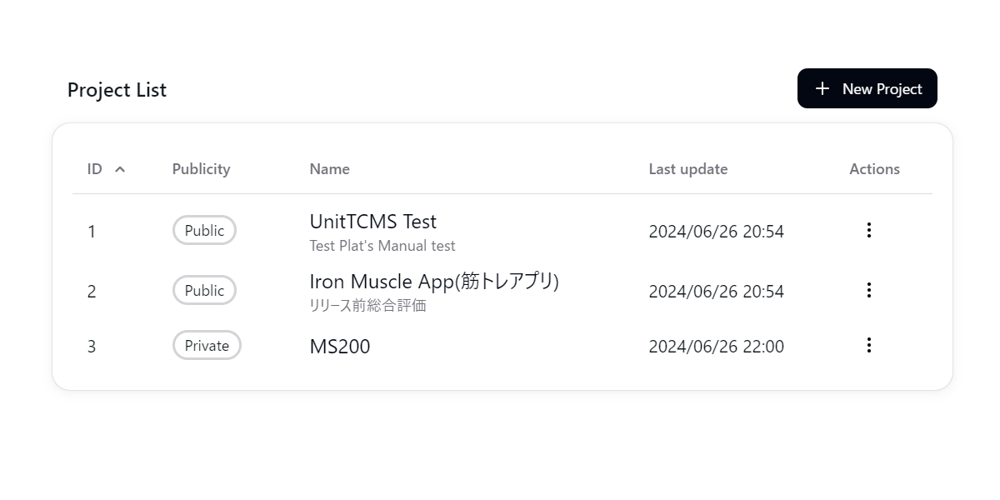
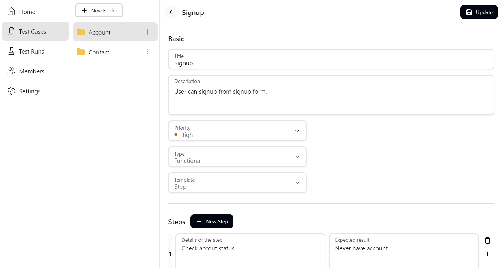
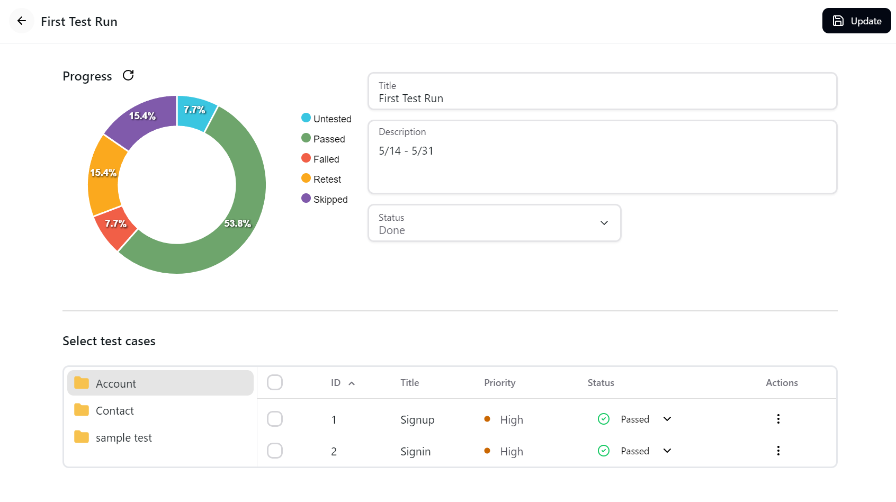
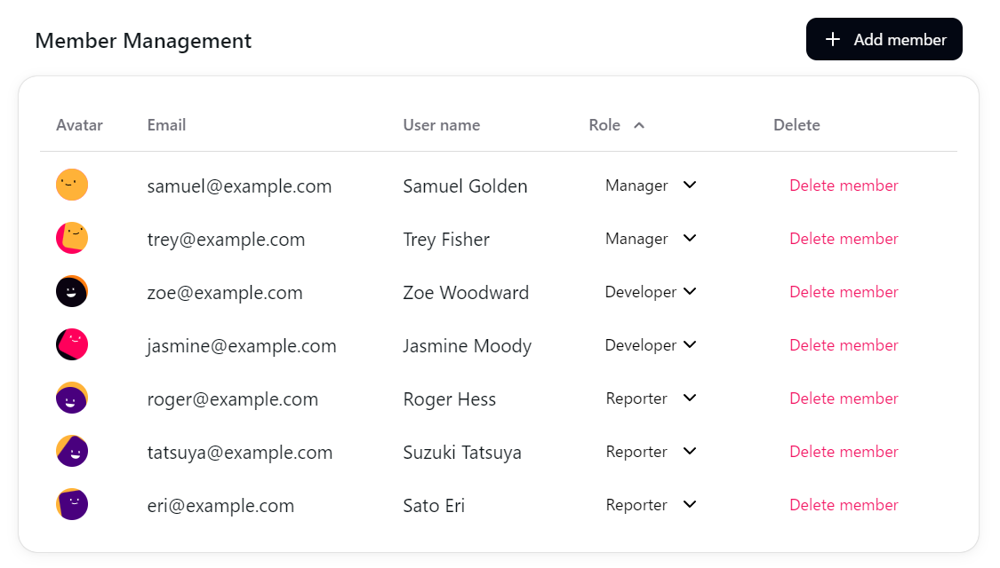

<p align="center">
  <a href="https://www.unittcms.org/en">
    
    <h1 align="center">UnitTCMS</h1>
  </a>
</p>
</br>
<p align="center">
  <a href="https://github.com/kimatata/unittcms/blob/main/LICENSE">
    
  </a>
  <a href="https://github.com/kimatata/unittcms/releases">
    
  </a>
</p>

UnitTCMS is an open source test case management system. The application is free and designed for self-hosted use. It can be used in environments with strict security requirements. For more information, please visit the demo site and docs.

[🧪Demo](https://www.unittcms.org)

[📘Docs](https://kimatata.github.io/unittcms/docs)

## Getting Started

```bash
git clone https://github.com/kimatata/unittcms.git
```

and start containers with the following command.

```bash
cd unittcms
docker-compose up --build
```

You can access the app at `http://localhost:8000`

[Looking for a non-Docker way?](https://kimatata.github.io/unittcms/docs/getstarted/manual)

## Why UnitTCMS

There are many test case management tools available in the market, which can be categorized into proprietary and open-source solutions.

Proprietary tools often come with modern, user-friendly interfaces but tend to be cloud-based, which may raise security concerns for some organizations. While some of them do offer on-premises options, these tend to be significantly more expensive.

There are also open-source tools, but many feature older user interfaces that involve frequent page reloads, which can hinder usability.

With these challenges in mind, I set out to develop a modern, user-friendly, open-source test case management tool that anyone can use for free in a secure, self-hosted environment.

## Features

### Project-Based

Manage test cases and test runs on a project-by-project basis. Our dashboard provides an at-a-glance view of the types of test cases and their progress for each project. This allows you to monitor project status in real-time and manage efficiently.



<hr />

### Test case management

Create folders within projects and define test cases with ease using our modern and intuitive UI. Attaching files enables detailed explanations of test cases, making it easy to share information across the entire team.



<hr />

### Test run management

Defined test cases can be reused multiple times in test runs, enabling efficient test cycles. Additionally, you can visually monitor the status of test runs and projects.



<hr />

### Project member management

Support team development by adding or removing members from projects. You can assign roles and set permissions for each member in detail. We provide three main roles: 'Manager' who manages the entire project, 'Developer' who designs the tests, and 'Reporter' who executes the tests.


