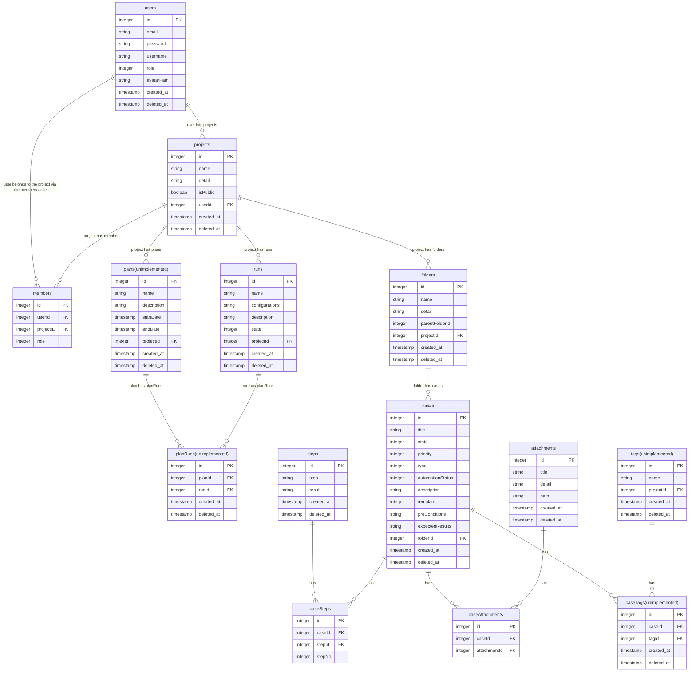

# Entity Relationship

```mermaid
erDiagram
  users ||--o{ projects : "user has projects"
  users ||--o{ members : "user belongs to the project via the members table"
  projects ||--o{ members: "project has members"
  projects ||--o{ folders: "project has folders"
  projects ||--o{ runs: "project has runs"
  projects ||--o{ "plans(unimplemented)": "project has plans"
  "plans(unimplemented)" ||--o{ "planRuns(unimplemented)": "plan has planRuns"
  runs ||--o{ "planRuns(unimplemented)": "run has planRuns"
  folders ||--o{ cases: "folder has cases"
  steps ||--o{ caseSteps: "has"
  cases ||--o{ caseSteps: "has"
  cases ||--o{ caseAttachments: "has"
  attachments ||--o{ caseAttachments: "has"
  cases ||--o{ "caseTags(unimplemented)": "has"
  "tags(unimplemented)" ||--o{ "caseTags(unimplemented)": "has"

  users {
    integer id PK
    string email
    string password
    string username
    integer role
    string avatarPath
    timestamp created_at
    timestamp deleted_at
  }

  projects {
    integer id PK
    string name
    string detail
    boolean isPublic
    integer userId FK
    timestamp created_at
    timestamp deleted_at
  }

  members {
    integer id PK
    integer userId FK
    integer projectID FK
    integer role
  }

  folders {
    integer id PK
    string name
    string detail
    integer parentFolderId
    integer projectId FK
    timestamp created_at
    timestamp deleted_at
  }

  runs {
    integer id PK
    string name
    string configurations
    string description
    integer state
    integer projectId FK
    timestamp created_at
    timestamp deleted_at
  }

  "plans(unimplemented)" {
    integer id PK
    string name
    string description
    timestamp startDate
    timestamp endDate
    integer projectId FK
    timestamp created_at
    timestamp deleted_at
  }

  "planRuns(unimplemented)" {
    integer id PK
    integer planId FK
    integer runId FK
    timestamp created_at
    timestamp deleted_at
  }

  cases {
    integer id PK
    string title
    integer state
    integer priority
    integer type
    integer automationStatus
    string description
    integer template
    string preConditions
    string expectedResults
    integer folderId FK
    timestamp created_at
    timestamp deleted_at
  }

  steps {
    integer id PK
    string step
    string result
    timestamp created_at
    timestamp deleted_at
  }

  caseSteps {
    integer id PK
    integer caseId FK
    integer stepId FK
    integer stepNo
  }

  attachments {
    integer id PK
    string title
    string detail
    string path
    timestamp created_at
    timestamp deleted_at
  }

  caseAttachments {
    integer id PK
    integer caseId FK
    integer attachmentId FK
  }

  "tags(unimplemented)" {
    integer id PK
    string name
    integer projectId FK
    timestamp created_at
    timestamp deleted_at
  }

  "caseTags(unimplemented)" {
    integer id PK
    integer caseId FK
    integer tagId FK
    timestamp created_at
    timestamp deleted_at
  }
```

